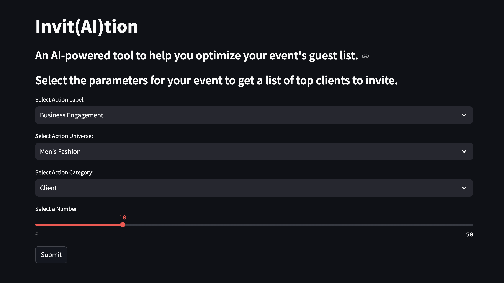

# XHEC-Eleven-Project
### January 2025 Group project for Eleven Strategy by X-HEC Data Science and AI for Business students.

This repository contains the code of our analysis and machine learning models. The slides of our data augmented commercial proposal can also be found. Here below are the guidelines to install and run the streamlit application.




---

## Set-up and Installation

### 1. Clone the repository

```bash
git clone https://github.com/tesscln/XHEC-Eleven-Project.git
```

```bash
cd XHEC-Eleven-Project
```

### 2. Install the dependencies

```bash
pip install -r requirements.txt
```

--- 

## Run the streamlit app

```bash
streamlit run app.py
```

A web page will open in your browser at **localhost:8501**

You can enter the details of your event, the number of clients you would like to invite, and enter ```Confirm```. Then, you can download the **.csv** file containing the best guest list to invite recommended for your specific event.